<a id="top"></a>

<!-- ═══════════════════════════════════════════════════════════════
     ✦  MISSION CONTROL // COMMAND DECK
     ✦  MUHAMMAD IMMAD AHMED KHAN
     ═══════════════════════════════════════════════════════════════ -->

<p align="center">
  
</p>

<div align="center">
  
</div>

<br/>

<div align="center">

  <a href="#top"></a>
  &nbsp;
  
  &nbsp;
  
  &nbsp;
  
  &nbsp;
  

</div>

<br/>

<p align="center">
  
</p>

<!-- ═══════════════════════════════════════════════════════════════
     ✦  QUICK NAV
     ═══════════════════════════════════════════════════════════════ -->

<div align="center">

| ` 01 ` | ` 02 ` | ` 03 ` | ` 04 ` | ` 05 ` |
|:------:|:------:|:------:|:------:|:------:|
| [**◈ MISSION BRIEFING**](#-01--mission-briefing) | [**◈ SYSTEMS ONBOARD**](#-02--systems-onboard) | [**◈ FIELD RESEARCH**](#-03--field-research) | [**◈ DEPLOYED MISSIONS**](#-04--deployed-missions) | [**◈ TELEMETRY**](#-05--telemetry) |

</div>

<br/>

<!-- ═══════════════════════════════════════════════════════════════
     ✦  01 · MISSION BRIEFING (about me)
     ═══════════════════════════════════════════════════════════════ -->

## ` 01 ` ◈ Mission Briefing

<table>
<tr>
<td width="62%" valign="top">

```yaml
# ─── /home/commander/mission-briefing.yaml ───
callsign      : MATRIX-01
commander     : Muhammad Immad Ahmed Khan
role          : Software Engineer
specialties   :
  - Full-Stack Systems Architecture
  - AI / ML Engineering
  - Cybersecurity Operations
  - Cloud & DevOps Orbital Deployment
research      : Generative AI · Autonomous Agents
base_station  : Rawalpindi, Pakistan 🇵🇰
mission_state : ALWAYS_BUILDING
motto         : "Ship it. Break it. Ship it again."
```

```bash
▸ commander@matrix-01 :~$ ./manifest --verbose
  loaded  » full_stack_module.so         [ OK ]
  loaded  » ai_ml_neural_stack.so        [ OK ]
  loaded  » security_hardening.ko        [ OK ]
  loaded  » cloud_devops_orchestrator.so [ OK ]
  status  » 4 modules armed · ready for deployment ⚡
```

</td>
<td width="38%" valign="top" align="center">


<br/><br/>


<br/>

<br/>


</td>
</tr>
</table>

<blockquote>

> ⌘ &nbsp;**Currently piloting:** production-grade **AI agents** that plan, code and ship autonomously.
> Long-term trajectory: turning natural-language intent into deployed software — end-to-end.

</blockquote>

<br/>

<p align="center">
  
</p>

<!-- ═══════════════════════════════════════════════════════════════
     ✦  02 · SYSTEMS ONBOARD (tech stack)
     ═══════════════════════════════════════════════════════════════ -->

## ` 02 ` ◈ Systems Onboard

```bash
▸ commander@matrix-01 :~$ diagnose --all-modules --output=human
◉ scanning subsystems ...  ██████████████████████  100%
◉ integrity check  ..........  PASS
◉ boot sequence   ..........  NOMINAL
```

<br/>

<div align="center">

#### `▸ CORE.LANGUAGES` — combat-ready weapons


<br/><br/>

#### `▸ FRAMEWORKS.FRONTIER` — battle-tested platforms


<br/><br/>

#### `▸ AI.STACK` — the neural arsenal


<br/><br/>

#### `▸ OPS.INFRA` — deployment & orchestration


<br/><br/>

#### `▸ RECON.TOOLS` — perimeter & analysis


</div>

<br/>

### ` ▸ POWER LEVELS ` &nbsp;·&nbsp; *self-reported combat readiness*

<table>
<tr>
<td width="50%">

```txt
Python         ████████████████████  95%
TypeScript     █████████████████░░░  85%
React/Next     ██████████████████░░  90%
FastAPI/Django █████████████████░░░  85%
PyTorch/TF     ███████████████░░░░░  75%
```

</td>
<td width="50%">

```txt
Docker/K8s     ████████████████░░░░  80%
LangChain/RAG  █████████████████░░░  85%
PostgreSQL     ███████████████░░░░░  75%
Cybersecurity  ██████████████░░░░░░  70%
Blender / 3D   █████████████░░░░░░░  65%
```

</td>
</tr>
</table>

<br/>

<p align="center">
  
</p>

<!-- ═══════════════════════════════════════════════════════════════
     ✦  03 · FIELD RESEARCH
     ═══════════════════════════════════════════════════════════════ -->

## ` 03 ` ◈ Field Research

<table>
<tr>
<td width="33%" align="center" valign="top">

### 🧠 &nbsp;Autonomous Agents
Multi-agent systems that plan, code, and self-correct.

<sub>`LangGraph` · `AutoGen` · `Tool-Use`</sub>

</td>
<td width="33%" align="center" valign="top">

### 🎨 &nbsp;Generative AI
Text → code, text → 3D, text → application pipelines.

<sub>`LLMs` · `RAG` · `Fine-Tuning`</sub>

</td>
<td width="33%" align="center" valign="top">

### 🛰️ &nbsp;Agent-Ops
Deploying, monitoring & securing agents in production.

<sub>`Observability` · `Guardrails`</sub>

</td>
</tr>
</table>

<br/>

<p align="center">
  
</p>

<!-- ═══════════════════════════════════════════════════════════════
     ✦  04 · DEPLOYED MISSIONS (projects)
     ═══════════════════════════════════════════════════════════════ -->

## ` 04 ` ◈ Deployed Missions

```bash
▸ commander@matrix-01 :~$ ls -la ~/missions/ --sort=impact --desc
total 4 · showing top payloads
```

<br/>

<!-- ── mission 01 ─────────────────────────────────────────────── -->
<table width="100%">
<tr>
<td width="35%" align="center" valign="middle">

<br/>
<h3>🎯 &nbsp;CareerMate</h3>
<sub>`~/missions/career-mate`</sub><br/><br/>

<a href="https://career-mate-8wo4.vercel.app"></a>
<a href="https://github.com/immad-khan/career-mate"></a>

</td>
<td valign="top">

> **AI-powered career command center.**
> HR, job-seeker & admin modules united by AI: course generation, resume builder, job scraping, cover-letter engine, live quizzes, learning paths, cold-email automation & real-time market insights.

`React` · `Django` · `Supabase` · `Groq` · `Puppeteer`

</td>
</tr>
</table>

<!-- ── mission 02 ─────────────────────────────────────────────── -->
<table width="100%">
<tr>
<td width="35%" align="center" valign="middle">

<br/>
<h3>🌿 &nbsp;BioScout</h3>
<sub>`~/missions/bioscout`</sub><br/><br/>

<a href="https://github.com/immad-khan/BioScout"></a>

</td>
<td valign="top">

> **AI biodiversity intelligence.**
> ResNet-50 species classification, GPS observation mapping and a RAG-powered Q&A layer that reasons over ecological datasets — all containerized and cloud-ready.

`Flask` · `MongoDB` · `HuggingFace` · `Docker`

</td>
</tr>
</table>

<!-- ── mission 03 ─────────────────────────────────────────────── -->
<table width="100%">
<tr>
<td width="35%" align="center" valign="middle">

<br/>
<h3>🧊 &nbsp;GEN3D</h3>
<sub>`~/missions/gen3d`</sub><br/><br/>

<a href="https://github.com/immad-khan/GEN3D"></a>

</td>
<td valign="top">

> **Text → 3D generation engine.**
> Natural-language prompts drive Ollama QwenCoder-7B with retrieval-augmented context, orchestrating procedural Blender pipelines that build 3D scenes end-to-end.

`FastAPI` · `Ollama` · `Blender` · `RAG`

</td>
</tr>
</table>

<!-- ── mission 04 ─────────────────────────────────────────────── -->
<table width="100%">
<tr>
<td width="35%" align="center" valign="middle">

<br/>
<h3>🛒 &nbsp;Smart Bazaar</h3>
<sub>`~/missions/smart-bazaar`</sub><br/><br/>

<a href="https://github.com/immad-khan/smart_bazaar"></a>

</td>
<td valign="top">

> **Unified Pakistani e-commerce marketplace.**
> Custom high-throughput web crawlers aggregate live inventory from major stores into one unified catalogue with smart search & side-by-side price comparison.

`Custom Crawlers` · `Full-Stack` · `Python`

</td>
</tr>
</table>

<br/>

<p align="center">
  
</p>

<!-- ═══════════════════════════════════════════════════════════════
     ✦  05 · TELEMETRY (github stats)
     ═══════════════════════════════════════════════════════════════ -->

## ` 05 ` ◈ Telemetry

```bash
▸ commander@matrix-01 :~$ sudo tail -f /var/log/orbital-telemetry.log
◉ uplink established ...  [ SYNC ]
◉ streaming metrics  ...  [ LIVE ]
```

<br/>

<div align="center">
  
  
</div>

<br/>

<div align="center">
  
  
</div>

<br/>

<div align="center">
  
</div>

<br/>

### ` ▸ CONTRIBUTION GRID `

<div align="center">
  <picture>
    <source media="(prefers-color-scheme: dark)"
      srcset="https://raw.githubusercontent.com/immad-khan/immad-khan/output/github-snake-dark.svg" />
    <source media="(prefers-color-scheme: light)"
      srcset="https://raw.githubusercontent.com/immad-khan/immad-khan/output/github-snake.svg" />
    
  </picture>
</div>

<br/>

<p align="center">
  
</p>

<!-- ═══════════════════════════════════════════════════════════════
     ✦  06 · COMMS CHANNELS (connect)
     ═══════════════════════════════════════════════════════════════ -->

## ` 06 ` ◈ Comms Channels

```bash
▸ commander@matrix-01 :~$ open-channel --broadcast
◉ scanning frequencies ...
◉ 6 open ports detected · ready for uplink
```

<br/>

<div align="center">

<a href="https://immad-khan.dev">
  
</a>
&nbsp;
<a href="https://linkedin.com/in/immad-khan">
  
</a>
&nbsp;
<a href="mailto:immadkhan.dev@gmail.com">
  
</a>

<br/><br/>

<a href="https://github.com/immad-khan">
  
</a>
&nbsp;
<a href="https://leetcode.com/immad-khan">
  
</a>
&nbsp;
<a href="https://instagram.com/immad-khan">
  
</a>

</div>

<br/>

<div align="center">

| ` UPLINK ` | ` CHANNEL ` | ` LATENCY ` |
|:----------:|:-----------:|:-----------:|
| 📧 Email | `immadkhan.dev@gmail.com` | `< 24h` |
| 💼 LinkedIn | `in/immad-khan` | `< 12h` |
| 🐙 GitHub | `@immad-khan` | `real-time` |

</div>

<br/>

<!-- ═══════════════════════════════════════════════════════════════
     ✦  FOOTER
     ═══════════════════════════════════════════════════════════════ -->

<div align="center">
  
</div>

<div align="center">
  
</div>

<br/>

<div align="center">
  <sub>
    <a href="#top">⬆ &nbsp;RETURN TO COMMAND DECK</a>
    &nbsp;·&nbsp;
    <code>commander@matrix-01</code>
    &nbsp;·&nbsp;
    engineered from orbit, deployed from Rawalpindi 🇵🇰
  </sub>
</div>
